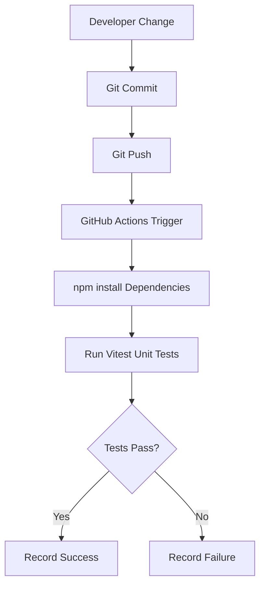

<h1 align="center">CareerOps Platform</h1>

<i>CI-Driven Quality Engineering | Operational Workflow Platform | Compliance-Aware Architecture</i>

CareerOps is a system-level Quality Engineering platform demonstrating how modern engineering practices enforce quality, validation, and compliance through architecture—not just testing.

This project showcases how to design systems where:

<ul>
<li>Quality is enforced through CI/CD pipelines</li>
<li>Validation is embedded across UI, API, and data layers</li>
<li>Operational workflows are fully traceable and auditable</li>
<li>Compliance requirements are programmatically validated</li>
</ul>

This is not a test automation project. 
It is a <b>quality engineering system</b>.

<h2>Build Status</h2>

<h2>Overview</h2>

CareerOps demonstrates how modern engineering practices can be applied to operational workflows, including:

<ul>
<li>Managing recruiter contacts</li>
<li>Tracking job opportunities</li>
<li>Generating unemployment compliance reports</li>
<li>Automating validation pipelines</li>
</ul>

The system is built around a CI-first architecture where validation occurs automatically through GitHub Actions.

<h2>System Capabilities</h2>
<h3>Core System</h3>
<ui>
  <li>Recruiter Contact Management System (UI + API + Validation)</li>
  <li>API Layer with Validation + CI Integration (Vitest + GitHub Actions)</li>
  <li>MySQL Data Model for Recruiter & Reporting Workflows</li>
</ui>
<h3>Workflow Engine</h3>
<ui>
  <li>Weekly Compliance Reporting Engine (Selection → Persist → Export)</li>
  <li>End-to-End Workflow Automation (Contact → Report → History → Export)</li>
</ui>
<h3>Reporting & Visibility</h3>
<ui>
  <li>Weekly Report History & Detail Viewer</li>
  <li>CSV Export for Compliance Reporting</li>
</ui>
<h3>Enhancements</h3>
<ui>
  <li>Company/Agency Search-as-you-type</li>
  <li>Role Type dropdown standardization</li>
  <li>Email validation improvements</li>
  <li>Follow-up date field standardization</li>
</ui>

<h2>What This Demonstrates</h2>
<ul>
<li>End-to-end workflow design from UI → API → database</li>
<li>Relational data modeling for audit and traceability</li>
<li>CI-enforced validation integrated into development lifecycle</li>
<li>Separation of concerns across UI, service, and data layers</li>
<li>Compliance-aware system design with historical reconstruction</li>
</ul>

<h2>System Architecture Layers</h2>

This platform is structured as a multi-layered quality engineering system:

<ul>
<li><b>Data Layer</b> → Audit-ready MySQL schema supporting recruiter and opportunity tracking</li>
<li><b>API Layer</b> → Service layer enabling CI-integrated validation and workflow orchestration</li>
<li><b>UI Layer</b> → Recruiter contact management interface supporting operational workflows</li>
<li><b>Metrics Layer</b> → Dashboard providing pipeline visibility and performance insights</li>
<li><b>Compliance Layer</b> → Weekly unemployment reporting with audit and traceability support</li>
</ul>

<h2>Architecture</h2>
<table>
  <tr>
    <th>Component</th>
    <th>Purpose</th>
  </tr>
  <tr>
    <td>GitHub</td>
    <td>Source control and project management</td>
  </tr>
  <tr>
    <td>GitHub Actions</td>
    <td>Continuous Integration pipeline</td>
  </tr>
  <tr>
    <td>Vitest</td>
    <td>Unit testing framework</td>
  </tr>
  <tr>
    <td>Playwright / Cypress</td>
    <td>Automation testing (planned)</td>
  </tr>
  <tr>
    <td>MySQL</td>
    <td>Data persistence layer</td>
  </tr>
  <tr>
    <td>Visual Studio Code</td>
    <td>Development environment</td>
  </tr>
</table>

<h2 align="center">CI Pipeline Flow</h2>

<h2>Project Structure</h2>
<pre><code>
careerops-platform/
│
├── .github/
│   └── workflows/
│       └── careerops-ci.yml
│
├── docs/
│   ├── architecture.md
│   ├── roadmap.md
│   └── run-history.md
│
├── src/
│   ├── components/
│   │   ├── App.jsx
│   │   └── EmployerContactForm.jsx
│   │
│   ├── server.js
│   ├── validateContact.js
│   └── validateWeeklyReport.js
│
├── tests/
│   ├── contactValidation.test.js
│   ├── dataValidation.test.js
│   └── weeklyReport.test.js
│
├── ui/
│   ├── app.js
│   ├── index.html
│   └── styles.css
│
├── .gitignore
├── LICENSE
├── package.json
├── package-lock.json
└── README.md
</code></pre>

<h3>Structure Overview</h3>
<ul>
<li><b>CI/CD</b> → GitHub Actions pipeline enforcing validation and build quality</li>
<li><b>docs/</b> → Architecture, roadmap, and execution history documentation</li>
<li><b>src/</b> → Backend services and validation logic</li>
<li><b>src/components/</b> → React-based UI components</li>
<li><b>tests/</b> → Vitest unit tests validating business rules and data integrity</li>
<li><b>ui/</b> → Frontend interface (HTML, JS, CSS)</li>
<li><b>Root</b> → Configuration, dependencies, and project metadata</li>
</ul>

<h2>API Endpoints</h2>

The CareerOps platform exposes RESTful endpoints to support operational workflows, validation enforcement, and data management.

<table>
  <tr>
    <th>Endpoint</th>
    <th>Method</th>
    <th>Purpose</th>
  </tr>

  <tr>
    <td>/api/contacts</td>
    <td>GET</td>
    <td>Retrieve all recruiter contact records</td>
  </tr>

  <tr>
    <td>/api/contacts</td>
    <td>POST</td>
    <td>Create a new recruiter contact</td>
  </tr>

  <tr>
    <td>/validate-weekly-report</td>
    <td>POST</td>
    <td>Validate weekly unemployment report data against business rules</td>
  </tr>
</table>

<h3>Validation Integration</h3>
<ul>
<li>All validation logic is enforced server-side to ensure consistency and reliability</li>
<li>Endpoints are designed to support both UI workflows and external system integration</li>
<li>Invalid data is rejected prior to persistence, ensuring data integrity and auditability</li>
</ul>

<h3>Sample Request Payload</h3>

Example request for validating a weekly unemployment report:

<pre><code>
POST /validate-weekly-report

{
  "week_start": "2026-03-01",
  "week_end": "2026-03-07",
  "job_contacts": [
    { "id": 1 }
  ]
}
</code></pre>

<h3>Expected Behavior</h3>

<ul>
<li>Validates reporting window does not exceed 7 days</li>
<li>Ensures at least one associated job contact exists</li>
<li>Returns structured validation response indicating pass/fail</li>
</ul>

<h2>Roadmap</h2>

<h3>Phase 1 — Foundation (Completed ✅)</h3>

<b>Result:</b> CI pipeline actively validating business rules with automated test enforcement.

<ul>
<li>Repository setup</li>
<li>Vitest test framework</li>
<li>GitHub Actions CI pipeline</li>
<li>Documentation and project board</li>
</ul>

<h3>Phase 2 — Validation Expansion (In Progress 🚧)</h3>
<ul>
<li>Playwright / Cypress → End-to-end automation (framework integration in progress)</li>
<li>Expanded validation coverage</li>
<li>Run history automation</li>
</ul>

<h3>Phase 3 — System Integration (Planned 🔜)</h3>
<ul>
<li>MySQL schema</li>
<li>API service layer</li>
<li>Recruiter contact management</li>
</ul>

<h3>Phase 4 — Reporting & Compliance (Planned 🔜)</h3>
<ul>
<li>Reporting dashboard</li>
<li>Compliance automation workflows</li>
</ul>

<h2>Engineering Goals</h2>
<ul>
<li>CI-driven validation embedded into the development lifecycle</li>  
<li>Automation as a system capability, not a standalone function</li>  
<li>Data integrity and auditability for real-world compliance scenarios</li>
<li>Observability and metrics for operational decision-making</li>  
<li>Reproducible, scalable quality architecture aligned with DevOps practices</li> 
</ul>

<h2>Validation Example (Working Proof)</h2>

This platform enforces business rules through automated validation and testing.

<h3>Current Proof Points</h3>
<ul>
<li>Weekly unemployment reports must include a valid reporting window and at least one associated job contact</li>
<li>Recruiter records must contain required fields such as name, company, and email</li>
</ul>

<h3>Enforcement</h3>
<ul>
<li>Validation logic implemented in <code>src/validateWeeklyReport.js</code></li>
<li>Verified with automated tests using Vitest</li>
<li>Invalid reports and incomplete data are rejected before submission</li>
<li>Exposed via API endpoint /validate-weekly-report for real-time validation and system integration</li>
</ul>

<h3>Result</h3>
<pre><code>✓ 4 automated tests passed (CI-validated)</code></pre>

This demonstrates how compliance rules and data quality requirements are programmatically enforced and continuously verified through CI pipelines.

<h2>Perspective</h2>

Automation does not create quality. 
Systems do.  

Quality is not validated at the end of delivery — it is enforced throughout the system.  

The future of Quality Engineering is not more tests. 
It is better system design.

