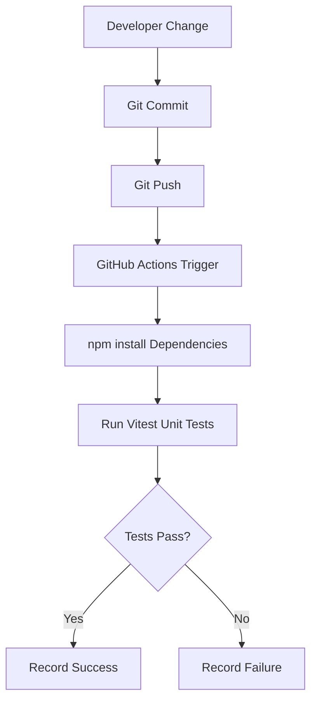

<h1 align="center">CareerOps Platform</h1>

A system-level Quality Engineering showcase demonstrating how CI-driven architectures, data design, and operational workflows integrate to enforce quality at scale.

This platform moves beyond traditional test automation to illustrate how engineering systems can be designed for:
<ul>
<li>End-to-end workflow validation</li>
<li>Real-time operational visibility</li>
<li>Auditability and compliance support</li>
<li>CI-integrated quality enforcement</li>
</ul>

Rather than focusing on tools alone, this project emphasizes how quality is embedded into the system architecture itself.

<h2>Build Status</h2>

<h2>Overview</h2>

CareerOps demonstrates how modern engineering practices can be applied to operational workflows, including:

<ul>
<li>Managing recruiter contacts</li>
<li>Tracking job opportunities</li>
<li>Generating unemployment compliance reports</li>
<li>Automating validation pipelines</li>
</ul>

The system is built around a CI-first architecture where validation occurs automatically through GitHub Actions.

## System Architecture Layers

This platform is structured as a multi-layered quality engineering system:

- **Data Layer** → Audit-ready MySQL schema supporting recruiter and opportunity tracking  
- **API Layer** → Service layer enabling CI-integrated validation and workflow orchestration  
- **UI Layer** → Recruiter contact management interface supporting operational workflows  
- **Metrics Layer** → Dashboard providing pipeline visibility and performance insights  
- **Compliance Layer** → Weekly unemployment reporting with audit and traceability support  

## Architecture
| Component | Purpose |
| --- | --- |
| GitHub | Source control and project management |
| GitHub Actions | Continuous Integration pipeline |
| Vitest | Unit testing framework |
| Playwright / Cypress | Automation testing (planned) |
| MySQL | Data persistence layer |
| Visual Studio Code | Development environment |
---

## CI Pipeline Flow

---
## Project Documentation
 - Architecture → docs/architecture.md
 - Run History → docs/run-history.md
 - Roadmap → docs/roadmap.md
---

## Roadmap
### Phase 1
 - Repository setup
 - Vitest test framework
 - GitHub Actions CI pipeline
 - Documentation and project board
### Phase 2
 - Playwright automation testing
 - Expanded validation coverage
 - Run history automation
### Phase 3
 - MySQL schema
 - API service layer
 - Recruiter contact management
### Phase 4
 - Reporting dashboard
 - Compliance automation workflows
---

## Engineering Goals

This project demonstrates a shift from tool-based automation to system-level quality engineering:

- CI-driven validation embedded into the development lifecycle  
- Automation as a system capability, not a standalone function  
- Data integrity and auditability for real-world compliance scenarios  
- Observability and metrics for operational decision-making  
- Reproducible, scalable quality architecture aligned with DevOps practices  
 - Automation-first architecture
 - DevOps-aligned quality engineering
 - Reproducible testing environmentss
---
