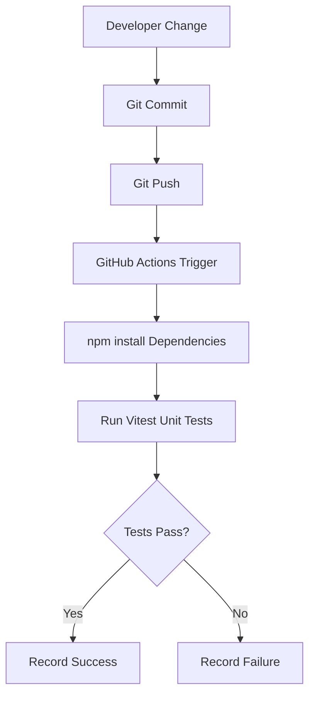

# Architecture

## Current Stack

| Component | Purpose |

| --- | --- |

| GitHub | Source control and backlog management |

| GitHub Actions | Continuous Integration pipeline |

| Vitest | Unit testing |

| Playwright / Cypress | Automation testing (planned) |

| MySQL | Data persistence layer |

| Visual Studio Code | Development environment |

## Current Flow

